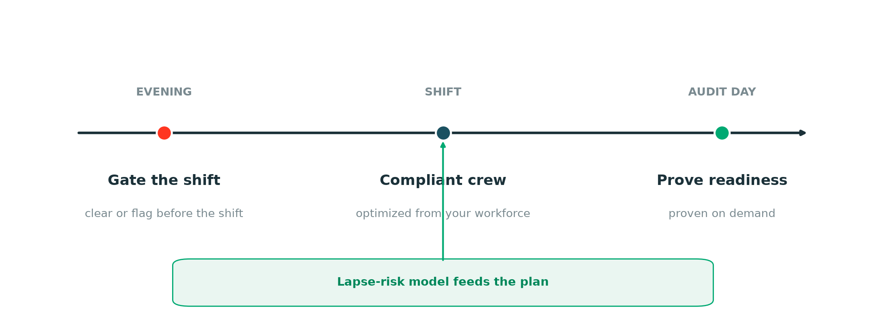
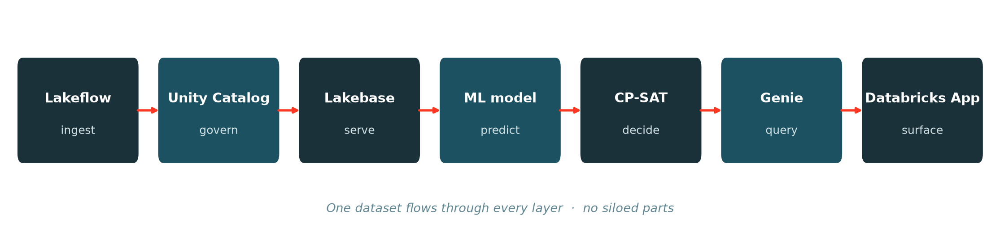

# ClearShift

### No one performs regulated work without proven qualification.

**ClearShift** makes sure no one is scheduled into hazardous, regulated work they are not
currently qualified to perform, and proves that readiness to an auditor on demand. One
governed journey on Databricks, built for manufacturers running confined-space, hot-work,
lockout/tagout, and powered-industrial-truck operations.



### The three questions it answers

> A learning management system records who took a course. It cannot answer the operational
> question a plant has at 5 p.m.

1. **Is this person cleared** for the work they are scheduled to do tomorrow?
2. **Is every regulated requirement at this site currently held**, and can we prove it the
   day an auditor asks?
3. **When a seat will not clear**, who is the compliant, lowest-risk substitute, and which
   seats cannot be staffed at all, so we act before the shift?

### What it's worth

Estimated annual value for a twelve-plant manufacturer. Conservative, before the tail risk.

| Lever | Basis | Annual |
|---|---|---|
| Regulatory penalties avoided | 1–2 serious or willful OSHA citations avoided ($16,550 serious, $165,514 willful/repeat) | **$165K–$330K** |
| Audit preparation labor | Roster reconciliation cut from ~40 hrs per plant per audit; 12 plants, 2 audits/yr | **~$70K** |
| Unplanned incident exposure | One recordable avoided at ~$40K direct and indirect | **~$40K** |
| **Annual total, excluding tail risk** | | **~$275K–$440K** |

Runs on existing Databricks for roughly **$60K a year**. A single confined-space fatality
with the litigation behind it runs well past **$1M** all-in, which is the real reason this
is a board-level control, not a line item.

## How it works

One dataset flows through every layer. No siloed demos stitched together.



| Layer | What it does |
|---|---|
| **Lakeflow** | Ingests HR, scheduler, and LMS sources to bronze, cleans to silver, builds the gold tables |
| **Unity Catalog** | Governs who sees what: plant and crew scoping, so one plant never sees another's workforce data |
| **Lakebase** | The operational store the app reads under scope; effective-dated requirements let past clearance be derived, not accumulated |
| **ML lapse-risk model** | Predicts who is about to lapse before the shift, with a plain-language reason per worker |
| **Optimizer (CP-SAT)** | Builds a compliant crew from the qualified pool; names the seats it cannot staff, with the nearest substitute |
| **Genie** | Natural-language questions over the governed gold tables, returning the SQL it ran |
| **Databricks App** | Surfaces all of it to the floor, the supervisor, the auditor, and the plant manager |

## What it is not

It does not replace a course catalogue, enrollment, content delivery, completions, or
assessment. Those belong in the learning management system. ClearShift sits beside that
system and consumes what it already records. It is a reference implementation intended to
be adapted, not deployed as-is.

## Running it locally

Requires Postgres 16 and Python 3.11+.

```bash
createdb clearshift
psql -d clearshift -f lakebase/ddl/01_schema.sql
psql -d clearshift -f lakebase/ddl/02_seed.sql
psql -d clearshift -f lakebase/ddl/03_views.sql

python3 -m venv .venv
.venv/bin/pip install -r app/requirements.txt

cd app
LAKEBASE_DATABASE=clearshift LAKEBASE_HOST=localhost \
  ../.venv/bin/python -m uvicorn backend.main:app --port 8010
```

Then open <http://127.0.0.1:8010>.

## Running the demo on a later day (reseed)

The demo is date-relative: the pre-shift clearance and the What-if studio read
tomorrow's regulated schedule (`work_date = CURRENT_DATE + 1`). The seed loads
those rows relative to the day it was first run, so on a later day they age out
and the What-if shows **0 seats**. Reseed tomorrow's schedule and rescore with a
single command (run it the morning you present):

```bash
# against the deployed Lakebase (needs Databricks CLI auth to the workspace):
.venv-model/bin/python scripts/reseed.py --profile horizontals

# against a local Postgres named clearshift:
LAKEBASE_HOST=localhost PGPASSWORD=<pw> .venv-model/bin/python scripts/reseed.py --local
```

It is idempotent (safe to run every day): it clears and re-inserts the
date-relative schedule rows, then re-runs `model/score_batch.py`. It prints the
number of regulated seats now scheduled for tomorrow.

## The model

Three tables carry the logic. Everything else is source data or presentation.

| Table | Answers |
|---|---|
| `qualification` | What credentials exist, which are regulated, which need a supervised first performance, whether they travel between sites, and how long they last |
| `workcenter_requirement` / `job_requirement` | What a given work center or job demands, effective-dated |
| `first_performance` | Whether a supervised first performance happened, and who supervised it |

`employee_qualification` is present so the demo runs standalone. In a real deployment it
should be a view over the existing certification records rather than a second copy.

### Why requirements are effective-dated

An audit asks what was required at the time, not what is required now. Storing only the
current requirement makes the historical question unanswerable.

### Why a qualification has a scope

Some credentials travel with the person; others are authorized per site or per asset.
Confined space entry is commonly permit-specific to a vessel, so treating every credential
as portable would clear someone for a space they were never authorized to enter.

## The views

| View | Purpose |
|---|---|
| `v_requirement_for_shift` | What a scheduled shift demands, from both the work center and the job |
| `v_qualification_state` | Whether a person held a credential, resolving current, expiring, expired, revoked and out-of-scope |
| `v_shift_clearance` | The verdict per person per requirement, with a plain-language reason |
| `v_site_roster` | The audit answer: everyone at a location and whether they are covered |
| `v_unplanned_transfer` | Cleared at the start of the shift, moved to work they were not qualified for |
| `v_renewal_pipeline` | What lapses inside ninety days |

### Two different notions of "first time"

These are distinct, and conflating them generates false alerts.

- **First time at this work center.** Reproduces first-occurrence detection. Useful
  context, but on its own not a reason to require supervision: a welder moving between two
  welding bays is not doing anything new.
- **First time performing.** Has this person ever worked anywhere that demanded this
  qualification? This is the one that gates. For site-scoped qualifications the site is
  part of the question.

Only days where the person **held** the qualification count as experience, so work
performed while unqualified does not satisfy the supervised-first-performance rule.

### The case a clock-in gate cannot catch

The source records scheduled and actual work center separately, so a further case is
visible: someone cleared at the start of the shift who moves into work they are not
qualified for. A gate evaluating only at clock-in does not re-check.
`v_unplanned_transfer` surfaces it.

## Pointing it at real data

Three source tables are assumed. Change the references in `v_requirement_for_shift` and
`v_qualification_state`; nothing else needs editing.

| Stand-in | Replace with |
|---|---|
| `gate.employee_current_workcenter_assignment` | The UKG current assignment synced table |
| `gate.employee_scheduled_workcenter_history` | The UKG scheduled history synced table |
| `gate.hr_employee` | The HCM employee synced table |

Column names in the stand-ins deliberately mirror the real ones, so the views transfer with
only the schema qualifier changed.

**Assumption to confirm:** all three sources refresh daily. If the HR side were to lag on a
monthly snapshot, a mid-month role change would be invisible to the gate for up to a month,
and role change driving new requirements is a stated requirement. The join works either
way, but the freshness claim would need restating.

## Site and supervisor are the access model

Not a filter. A supervisor sees their crew, a plant manager sees their site, safety sees
everything, and an unknown principal sees nothing. `gate.viewer_scope` drives it and
`db.scope_clause` applies it to every read.

Two consequences worth keeping:

- Every view the predicate touches must expose both `location` and `supervisor_id`.
  Omitting one forces the caller to weaken the predicate, widening a crew supervisor's
  visibility to the whole site.
- In a real deployment this belongs in row-level security in the database as well. Doing it
  in one place in the application keeps the demo readable, but it is not sufficient on its own.

## Alerts as a control rather than a notification

`gate.alert` carries an acknowledgement and `gate.first_performance` names the supervisor
who signed off, so the record of the control being applied is itself audit evidence.

Routing follows the supervisor of record, escalating to the plant manager and then to
safety on non-acknowledgement. Two hierarchies exist and differ: HR holds the supervisor
of record; the timekeeping system holds who supervises a work center on a shift. This uses
HR. Which should drive routing is an open decision.

## Known gaps

Where this model is incomplete or untested.

- **Site population is incomplete.** HR headcount misses contractors, transfers and
  temporary staff, all of whom may be on site performing the work. `hr_employee.regtemp`
  is the starting point for addressing this.
- **Alert volume is untested.** A daily digest of everything gets filtered to junk within
  two weeks. Thresholds need tuning against real volumes.
- **Asset-scoped qualifications are modeled but not exercised.** The scope column supports
  per-vessel authorization; the seed data does not demonstrate it.
- **No renewal booking.** The pipeline identifies who needs scheduling. It does not schedule.
- **Synthetic data throughout.** Roughly a dozen people. Nothing here demonstrates behavior
  at plant scale.

## Data

Facility names are real and public. Every person, identifier, credential and schedule row is
invented. No production data is reproduced anywhere in this repository.
